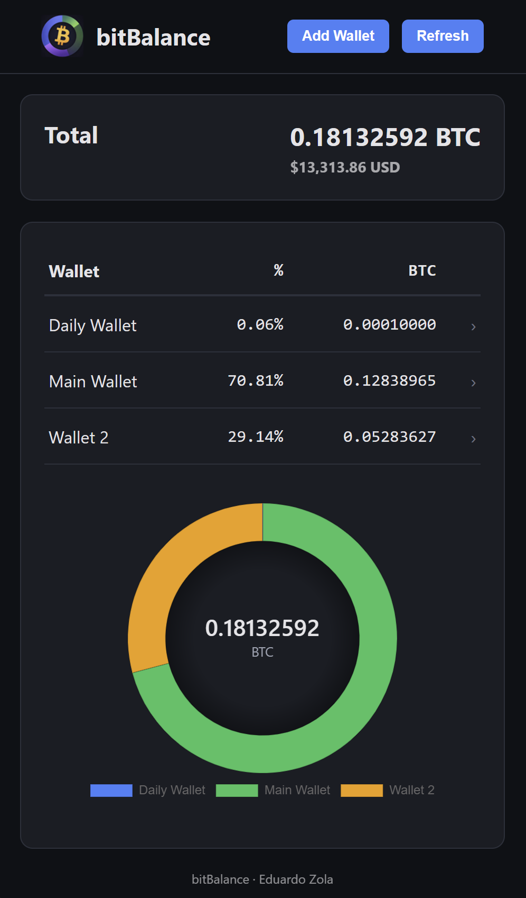

 
# bitBalance

Track your Bitcoin wallets privately from your own Umbrel.

A simple and private **Bitcoin wallet balance tracker** for XPUB, YPUB and ZPUB.

bitBalance allows you to monitor multiple Bitcoin wallets using **your own Electrs server**, without relying on third-party APIs.

Runs locally on **Umbrel** and keeps all wallet data private.

---

## Why bitBalance?

Many wallet tracking services require sending your XPUB to external servers.

This exposes:

- all wallet addresses
- wallet balances
- transaction history

bitBalance avoids this by connecting **only to your own node**.

XPUB / YPUB / ZPUB  
↓  
bitBalance  
↓  
Electrs  
↓  
Bitcoin Core  

Your wallet data never leaves your infrastructure.

---

## Features

- Track multiple Bitcoin wallets
- Supports **XPUB, YPUB and ZPUB**
- Connects to your **local Electrs server**
- No third-party APIs
- Fully self-hosted
- Lightweight and simple interface
- Runs locally on **Umbrel**

---

## Screenshot

---

## Supported Wallet Types

| Type | Standard | Script |
|-----|------|------|
| XPUB | BIP44 | Legacy |
| YPUB | BIP49 | Nested SegWit |
| ZPUB | BIP84 | Native SegWit |

---

## Requirements

- Umbrel
- Electrs installed

---

## Installation

Install **bitBalance** directly from the Umbrel App Store.

After installation the app will automatically connect to your **Electrs server**.

---

## Usage

1. Open bitBalance
2. Click **Add Wallet**
3. Enter a wallet name
4. Paste an **XPUB / YPUB / ZPUB**

The wallet balance will be tracked automatically.

---

## Privacy

bitBalance is designed with privacy in mind.

- No third-party APIs
- No analytics
- No external wallet queries
- Everything runs locally on your node

---

## Architecture

bitBalance derives wallet addresses locally and queries Electrs directly for balance and transaction data.

XPUB / YPUB / ZPUB  
↓ (local derivation)  
bitBalance  
↓ (TCP connection)  
Electrs  
↓  
Bitcoin Core  

No external services are involved in this process.

All balance calculations are deterministic and based solely on your node’s data.

---

## Umbrel Integration Details

This app is designed to run inside Umbrel’s managed environment.

- Uses the built-in Electrs service via `$APP_ELECTRS_NODE_IP`
- Does not define custom Docker networks (Umbrel handles service networking)
- Persists state using `${APP_DATA_DIR}/data`
- Includes a `.gitkeep` file to ensure volume path consistency in clean deployments

These constraints ensure compatibility with Umbrel’s runtime and predictable behavior across installations.

---

## Design Principles

- Privacy by default (no external calls)
- Deterministic behavior (no hidden state)
- Minimal dependencies
- Explicit over implicit

This project favors simplicity and control over abstraction.

---

## Developer

egzola

GitHub  
https://github.com/egzola

---

## License

MIT
